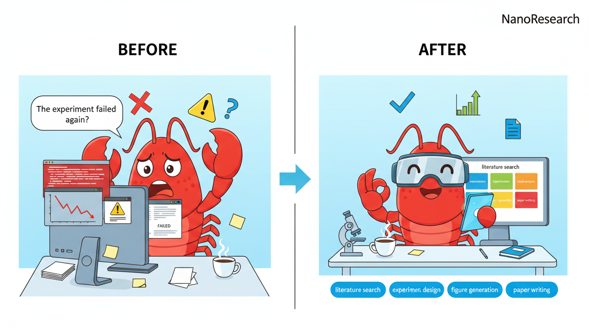

<div align="center">
  

# NanoResearch

**中文** | [English](README_en.md)

**端到端自主 AI 科研引擎**

NanoResearch 是一个端到端的自主科研系统。与传统的"AI 写论文"工具不同，NanoResearch **真正运行计算实验**——它不仅生成代码，还能将代码提交到 GPU 集群执行训练，收集真实实验结果，生成论文配图，最终输出一篇有实验数据支撑的完整 LaTeX 论文。

<p>
  <a href="#quick-start"><b>Quick Start</b></a> ·
  <a href="#showcase"><b>Showcase</b></a> ·
  <a href="#pipeline"><b>Pipeline</b></a>
</p>

<p>
  <a href="https://github.com/OpenRaiser/NanoResearch"></a>
  
  
  
  
</p>
</div>

---

## Highlights

大多数 AI 科研工具只能生成文本大纲或论文草稿。**NanoResearch 的核心差异在于它能真正执行计算实验：**

```text
💡 Idea Generation        自动检索文献、发现研究空白、提出假说
        ↓
📋 Experiment Planning    设计详细的实验方案和技术路线
        ↓
💻 Code Generation        生成完整可运行的实验代码（含训练脚本、数据加载、模型定义）
        ↓
🚀 GPU Execution          自动提交到 SLURM 集群或本地 GPU 执行训练
        ↓
📊 Results Analysis       解析训练日志，提取指标，生成结构化实验证据
        ↓
📈 Figure Generation      根据真实实验数据自动生成论文配图（结果图、消融图、架构图）
        ↓
✍️ Paper Writing          基于真实实验结果撰写 LaTeX 论文（非凭空生成）
        ↓
🔍 Review & Revision      自动审稿并修订
```

> **关键区别**：论文中的每一个数据、表格、图表都来自实际运行的实验结果，而非 LLM 编造。

---

<div align="center">
  
  <p><b>🦀 告别手动科研的痛苦循环</b></p>
  <p>不再反复调试失败的实验、手动整理数据、从零写论文——<br/>NanoResearch 将完整科研流程自动化，让你专注于真正的研究创新。</p>
</div>

---

## Table of Contents

- [Highlights](#highlights)
- [Why NanoResearch](#why-nanoresearch)
- [Use Cases](#use-cases)
- [Showcase](#showcase)
- [Pipeline](#pipeline)
- [Key Capabilities](#key-capabilities)
- [Quick Start](#quick-start)
- [Claude Code Mode](#claude-code-mode)
- [Execution Profiles](#execution-profiles)
- [CLI Commands](#cli-commands)
- [Output Structure](#output-structure)
- [Model Routing](#model-routing)
- [Paper Formats](#paper-formats)
- [Project Structure](#project-structure)
- [Feishu Bot](#feishu-bot)
- [FAQ](#faq)
- [Citation](#citation)
- [License](#license)

## Why NanoResearch

| 特性 | 传统 AI 写作工具 | NanoResearch |
|------|-----------------|-------------|
| 文献检索 | 部分支持 | ✅ OpenAlex + Semantic Scholar 自动检索 |
| 实验设计 | ❌ | ✅ 自动生成实验方案 |
| 代码生成 | 部分支持 | ✅ 完整可运行的实验代码 |
| **实验执行** | ❌ | ✅ **自动提交 GPU 训练（本地/SLURM）** |
| 结果分析 | ❌ | ✅ 解析真实训练日志和指标 |
| 论文配图 | ❌ | ✅ 基于真实数据生成图表 |
| 论文撰写 | 大纲/草稿 | ✅ 基于实验证据的完整 LaTeX 论文 |
| 断点续跑 | ❌ | ✅ 任意阶段失败可恢复 |
| 多模型协作 | 单一模型 | ✅ 每个阶段可配置不同模型 |

## Use Cases

- **科研原型验证** — 快速将一个研究想法变成完整的实验+论文工作空间
- **自主实验** — 让系统自动生成代码、提交 GPU 训练、分析结果
- **Benchmark 批量生成** — 对多个课题批量运行，生成可复现的实验结果
- **论文初稿辅助** — 基于真实实验数据产出 LaTeX 草稿，加速写作
- **科研流程审计** — 完整的工作空间、中间产物和日志，可追溯每一步

## Showcase

### Generated Research Workspace

一次典型的 NanoResearch 运行会产出一个完整、可检查的工作空间：

- 文献检索与实验规划产物
- 可运行的实验代码
- 自动生成的论文配图
- LaTeX 论文源码和参考文献
- 可导出的论文打包文件

### Example Outputs

<table>
  <tr>
    <td align="center" width="50%">
      
      <br />
      <sub><b>Framework Overview</b></sub>
    </td>
    <td align="center" width="50%">
      
      <br />
      <sub><b>Examples</b></sub>
    </td>
  </tr>
</table>

<table>
  <tr>
    <td align="center" width="50%">
      
      <br />
      <sub><b>Main Results</b></sub>
    </td>
    <td align="center" width="50%">
      
      <br />
      <sub><b>Ablation</b></sub>
    </td>
  </tr>
</table>

## Pipeline

```text
Research Topic
  ↓
IDEATION → PLANNING → SETUP → CODING → EXECUTION → ANALYSIS → FIGURE_GEN → WRITING → REVIEW
  ↓
Exported workspace: paper.pdf / paper.tex / references.bib / figures / code / data
```

### Stage Summary

| Stage | 功能 | 说明 |
|-------|------|------|
| `IDEATION` | 文献检索与创意生成 | 搜索学术文献、发现研究空白、提出假说、收集必引文献 |
| `PLANNING` | 实验方案设计 | 将研究想法转化为详细的实验蓝图 |
| `SETUP` | 环境准备 | 准备代码仓库、依赖环境、模型和数据集 |
| `CODING` | 代码生成 | 生成完整可运行的实验项目（含训练脚本、数据处理、模型定义） |
| `EXECUTION` | **实验执行** | **在本地 GPU 或 SLURM 集群上运行训练，支持自动重试和调试** |
| `ANALYSIS` | 结果分析 | 解析训练日志和指标，生成结构化实验证据 |
| `FIGURE_GEN` | 图表生成 | 创建架构图、结果对比图、消融实验图 |
| `WRITING` | 论文撰写 | 基于实验证据和引用撰写 LaTeX 论文 |
| `REVIEW` | 审稿与修订 | 自动审阅各章节，检测问题并修订 |

### Execution Details

`EXECUTION` 阶段是 NanoResearch 的核心差异化能力：

- **自动提交 SLURM 作业**：生成 sbatch 脚本，提交到集群，监控作业状态
- **本地 GPU 执行**：自动检测可用 GPU，管理训练进程
- **自动调试与重试**：训练失败时自动分析错误日志，修复代码并重新执行
- **实时日志监控**：追踪训练进度和指标变化
- **混合执行模式**：可根据任务复杂度在本地和集群之间自动切换

## Key Capabilities

### Grounded Writing
- 论文内容基于结构化实验证据、引用和实验产物，而非纯文本生成
- 追踪必引文献及引用质量
- 输出带 BibTeX 支持的 LaTeX 论文

### Real Experiment Evidence
- 写作和配图消费真实的实验输出和分析产物
- 表格、数据声明和图表绑定到实际实验结果
- 保留中间 JSON 产物，便于调试和审计

### Hybrid Figure Generation
- 架构图可由图像模型生成
- 结果图和消融图由代码生成（基于真实数据）
- 图表提示、脚本和输出均保存在工作空间中

### Checkpoint & Resume
- 每个阶段的产物写入磁盘，失败可从上次断点恢复
- 避免从头重跑整个流水线

## Quick Start

### 1) Install

```bash
git clone https://github.com/OpenRaiser/NanoResearch.git
cd NanoResearch
pip install -e ".[dev]"
```

### 2) Configure

创建 `~/.nanobot/config.json`。**需替换 `base_url` 和 `api_key` 为你自己的 OpenAI 兼容 API 端点**，并为每个阶段选择可用的模型：

```json
{
  "research": {
    "base_url": "https://your-openai-compatible-endpoint/v1/",
    "api_key": "your-api-key",
    "template_format": "neurips2025",
    "execution_profile": "local_quick",
    "writing_mode": "hybrid",
    "max_retries": 2,
    "auto_create_env": true,
    "auto_download_resources": true,
    "ideation": { "model": "your-model", "temperature": 0.5, "max_tokens": 16384, "timeout": 600.0 },
    "planning": { "model": "your-model", "temperature": 0.2, "max_tokens": 16384, "timeout": 600.0 },
    "code_gen": { "model": "your-model", "temperature": 0.1, "max_tokens": 16384, "timeout": 600.0 },
    "writing": { "model": "your-model", "temperature": 0.4, "max_tokens": 16384, "timeout": 600.0 },
    "figure_gen": {
      "model": "gemini-3.1-flash-image-preview",
      "image_backend": "gemini",
      "temperature": null,
      "timeout": 300.0
    },
    "review": { "model": "your-model", "temperature": 0.3, "max_tokens": 16384, "timeout": 300.0 }
  }
}
```

#### Recommended Models

| Stage | 任务 | 推荐模型 | 经济型 |
|-------|------|---------|-------|
| `ideation` | 文献检索+假说生成 | DeepSeek-V3.2 | DeepSeek-V3.2 |
| `planning` | 实验设计 | Claude Sonnet 4.6 | DeepSeek-V3.2 |
| `code_gen` | 代码生成 | GPT-5.2-Codex / Claude Opus 4.6 | DeepSeek-V3.2 |
| `writing` | 论文撰写 | Claude Opus 4.6 / Claude Sonnet 4.6 | DeepSeek-V3.2 |
| `figure_prompt` | 图表描述 | GPT-5.2 | DeepSeek-V3.2 |
| `figure_code` | 图表绘制代码 | Claude Opus 4.6 | DeepSeek-V3.2 |
| `figure_gen` | AI 架构图生成 | Gemini 3.1 Flash（原生图像生成） | Gemini 3.1 Flash |
| `review` | 审稿+修订 | Claude Sonnet 4.6 / Gemini Flash | DeepSeek-V3.2 |

> **说明**：所有文本模型通过单一 OpenAI 兼容端点访问。对于不支持 temperature 的模型（如 Codex、o 系列），设置 `temperature: null`。`figure_gen` 使用 Gemini 原生图像生成 API，需设置 `"image_backend": "gemini"`。

#### Estimated Cost

| 场景 | 模型选择 | 时间 | 预估费用 |
|------|---------|------|---------|
| **仅生成论文**（跳过实验） | 全部 DeepSeek-V3.2 | ~30 分钟 | ~$0.5 - $1 |
| **仅生成论文**（跳过实验） | 混合（Claude 写作，DeepSeek 其余） | ~30 分钟 | ~$3 - $8 |
| **完整流水线**（含实验） | 全部 DeepSeek-V3.2 | 2 - 5 小时 | ~$1 - $3 |
| **完整流水线**（含实验） | 混合（Claude/GPT 写作+代码，DeepSeek 其余） | 2 - 5 小时 | ~$10 - $20 |

> 完整流水线的执行时间取决于实验复杂度和计算资源（本地 GPU vs SLURM 集群）。"仅生成论文"模式通过 `"skip_stages": ["SETUP", "CODING", "EXECUTION", "ANALYSIS"]` 跳过实验相关阶段。

环境变量覆盖：

- `NANORESEARCH_BASE_URL`
- `NANORESEARCH_API_KEY`
- `NANORESEARCH_TIMEOUT`

#### Literature Search API Keys (optional)

IDEATION 阶段使用 OpenAlex 和 Semantic Scholar 检索学术文献。不配置 API Key 也能运行（匿名访问），但速率限制较低。

| Service | 获取方式 | Config key | Env variable |
|---------|---------|------------|--------------|
| [OpenAlex](https://developers.openalex.org/) | 免费 — [openalex.org/settings/api-key](https://openalex.org/settings/api-key) | `openalex_api_key` | `OPENALEX_API_KEY` |
| [Semantic Scholar](https://www.semanticscholar.org/product/api#api-key) | 免费 — [semanticscholar.org](https://www.semanticscholar.org/product/api#api-key) | `s2_api_key` | `S2_API_KEY` |

### 3) Validate

```bash
nanoresearch run --topic "Adaptive Sparse Attention Mechanisms" --dry-run
```

### 4) Run

```bash
nanoresearch run --topic "Adaptive Sparse Attention Mechanisms" --format neurips2025 --verbose
```

### 5) Resume

```bash
nanoresearch resume --workspace ~/.nanobot/workspace/research/{session_id} --verbose
```

### 6) Export

```bash
nanoresearch export --workspace ~/.nanobot/workspace/research/{session_id} --output ./my_paper
```

## Claude Code Mode

除了 Python CLI，NanoResearch 还支持通过 **[Claude Code](https://docs.anthropic.com/en/docs/claude-code)** 直接驱动研究流水线——**无需配置任何 API Key**。

### 工作原理

在 Claude Code 集成模式下，Claude Code 本身就是研究引擎：

- **WebSearch** 替代外部 API 进行文献检索（arXiv、Semantic Scholar、Google Scholar）
- **Bash** 执行实验代码、提交 SLURM 作业、编译 LaTeX
- **文件读写** 生成实验代码、论文和结构化产物

### Quick Start

```bash
# 1. Clone 项目
git clone https://github.com/OpenRaiser/NanoResearch.git
cd NanoResearch

# 2. 启动 Claude Code（确保已安装 claude CLI）
claude

# 3. 在 Claude Code 中运行完整流水线
/project:research "Your Research Topic Here"
```

### Available Commands

| Command | 功能 |
|---------|------|
| `/project:research <topic>` | 运行完整 9 阶段流水线 |
| `/project:ideation <topic>` | Stage 1: 文献检索 + 假说生成 |
| `/project:planning` | Stage 2: 实验方案设计 |
| `/project:experiment` | Stages 3-5: 环境准备 + 代码生成 + 实验执行 |
| `/project:analysis` | Stage 6: 实验结果分析 |
| `/project:writing` | Stages 7-8: 图表生成 + 论文撰写 |
| `/project:review` | Stage 9: 多视角审稿 + 修订 |
| `/project:status` | 查看当前流水线状态 |
| `/project:resume` | 从断点恢复流水线 |

### Example Workflow

```bash
# 启动一个完整的研究项目
/project:research "Dropout Regularization Comparison on Tabular Data"

# 查看当前进度
/project:status

# 如果中途失败，从断点恢复
/project:resume
```

### Tips

- **架构图生成**：推荐使用 Nano Banana 系列图像模型生成高质量架构图。Claude Code 模式下可在 `figure_gen` 阶段通过 Bash 调用图像生成 API。
- **LaTeX 编译**：推荐使用 `tectonic` 替代 `pdflatex`。Conda 安装的 texlive 可能缺少 `pdflatex.fmt`，导致编译失败。安装 tectonic：`conda install -c conda-forge tectonic`。
- **断点续跑**：所有阶段的产物保存在 `manifest.json` 中，支持任意阶段恢复。
- **与 Python CLI 兼容**：Claude Code 模式生成的工作空间与 Python CLI 完全兼容，可混合使用两种模式。

---

## Execution Profiles

| Profile | 说明 |
|---------|------|
| `fast_draft` | 轻量级草稿模式，快速迭代 |
| `local_quick` | 优先本地执行，需要时可升级到 SLURM |
| `cluster_full` | 集群优先，适合重量级实验 |

## CLI Commands

| Command | 用途 |
|---------|------|
| `nanoresearch run --topic "..."` | 启动新的流水线运行 |
| `nanoresearch resume --workspace ...` | 从上次断点恢复 |
| `nanoresearch status --workspace ...` | 查看各阶段状态和产物 |
| `nanoresearch list` | 列出已保存的研究会话 |
| `nanoresearch export --workspace ...` | 导出论文打包 |
| `nanoresearch config` | 打印当前配置（密钥已屏蔽） |
| `nanoresearch inspect --workspace ...` | 检查工作空间产物 |
| `nanoresearch health` | 运行环境/配置健康检查 |
| `nanoresearch delete <session_id>` | 删除指定会话 |

```bash
nanoresearch --help
```

## Output Structure

导出的论文目录：

```text
my_paper/
├── paper.pdf
├── paper.tex
├── references.bib
├── figures/
├── code/
├── data/
└── manifest.json
```

完整工作空间（含中间产物）：

```text
~/.nanobot/workspace/research/{session_id}/
├── manifest.json
├── papers/
├── plans/
├── code/
├── figures/
├── drafts/
├── logs/
└── ...
```

## Model Routing

NanoResearch 通过统一配置层将不同阶段路由到不同模型，让你可以按任务特性混合搭配模型，而非强制所有阶段使用同一模型。

可路由的阶段：

- `ideation` — 文献检索与创意
- `planning` — 实验设计
- `experiment` — 实验相关
- `code_gen` — 代码生成
- `writing` — 论文撰写
- `figure_prompt` — 图表描述
- `figure_code` — 图表代码
- `figure_gen` — 图像生成
- `review` — 审稿
- `revision` — 修订

系统基于 **OpenAI 兼容端点**构建，支持按阶段覆盖配置。

## Paper Formats

模板从 `nanoresearch/templates/` 自动发现。当前内置模板：

- `arxiv`
- `icml`
- `neurips`
- `neurips2025`

```bash
nanoresearch run --topic "Graph Foundation Models for Biology" --format neurips2025
```

## Project Structure

```text
nanoresearch/
├── nanoresearch/
│   ├── cli.py
│   ├── config.py
│   ├── agents/
│   ├── pipeline/
│   ├── schemas/
│   └── templates/
├── mcp_server/
├── skills/
├── outputs/
├── PROJECT_DOCUMENTATION.md
└── pyproject.toml
```

### Important Modules

- `nanoresearch/agents/` — 各阶段 Agent（文献检索、实验设计、代码生成、执行、分析、配图、写作、审稿）
- `nanoresearch/pipeline/` — 编排器、状态机、多模型调度、工作空间管理
- `nanoresearch/templates/` — LaTeX 模板和会议格式
- `mcp_server/` — 研究和文档工作流的工具服务集成

## Feishu Bot

NanoResearch 内置飞书（Lark）机器人，可直接在飞书聊天中触发流水线、查看进度、接收论文——无需打开终端。

### Prerequisites

```bash
pip install lark-oapi
```

### Configure

在 [open.feishu.cn](https://open.feishu.cn) 创建自定义应用并获取 App ID 和 App Secret：

```bash
export FEISHU_APP_ID="cli_xxx"
export FEISHU_APP_SECRET="xxx"
```

或写入 `~/.nanobot/config.json`：

```json
{
  "feishu": {
    "app_id": "cli_xxx",
    "app_secret": "xxx"
  }
}
```

### Launch

```bash
nanoresearch feishu          # 启动机器人
nanoresearch feishu -v       # 详细日志模式
```

机器人通过 WebSocket 长连接通信（无需公网服务器或 Webhook URL）。按 `Ctrl+C` 停止。

### Supported Commands

| Command | 描述 |
|---------|------|
| `/run <课题>` | 对指定课题启动研究流水线 |
| `/status` | 查看当前任务进度 |
| `/list` | 列出所有历史研究会话 |
| `/stop` | 停止当前运行的流水线 |
| `/export` | 重新导出最近完成的研究 |
| `/new` | 清除对话记忆，重新开始 |
| `/help` | 显示帮助信息 |

### Natural Language Mode

也可以直接自然语言聊天——机器人充当 AI 科研助手：

- **提问科研问题**："多模态学习最新进展有哪些？"
- **请求写论文**："帮我写一篇关于自适应稀疏注意力的论文"——机器人会引导你回答 5 个快速问题（课题、论文类型、数据场景、创新偏好、目标），然后自动启动流水线
- **对话记忆**：机器人在对话内保持上下文记忆，使用 `/new` 重置

流水线完成后，机器人自动将编译好的 `paper.pdf` 发送到聊天中。

## FAQ

### NanoResearch 真的会运行实验吗？

是的。流水线会生成可运行的代码，在本地 GPU 或 SLURM 集群上执行，并将实验产物传递给后续的分析、配图和写作阶段。**论文中的数据来自真实实验，而非模型编造。**

### 可以断点续跑吗？

可以。工作空间按阶段保存检查点，`nanoresearch resume --workspace ...` 会从上次未完成或失败的阶段继续。

### 每个阶段都需要配置模型吗？

不需要。NanoResearch 支持按阶段配置模型路由，文献检索、代码生成、写作、配图和审稿可以使用不同模型，也可以全部使用同一个模型。

### 生成的论文可以直接投稿吗？

建议将其视为高质量初稿，而非最终投稿版本。系统可以生成完整的论文工作空间和编译好的 PDF，但人工审阅和修订仍然必要。

## Requirements

- Python **3.10+**
- **OpenAI 兼容 API 端点**（用于文本模型阶段）
- 可选：图像模型访问权限（用于部分配图）
- `tectonic` 或 `pdflatex`（用于 PDF 编译）

> **推荐使用 `tectonic`**：Conda 安装的 texlive 可能缺少 `pdflatex.fmt`，导致编译失败且修复困难。`tectonic` 会自动下载所需的 TeX 包，无需额外配置。

```bash
conda install -c conda-forge tectonic
```

## Acknowledgements

- [claude-scholar](https://github.com/Galaxy-Dawn/claude-scholar) — Claude Code 的科研技能扩展

## Star History

[](https://star-history.com/#OpenRaiser/NanoResearch&Date)

## Citation

```bibtex
@software{nanoresearch2026,
  title = {NanoResearch},
  author = {OpenRaiser},
  year = {2026},
  url = {https://github.com/OpenRaiser/NanoResearch}
}
```

## License

MIT
